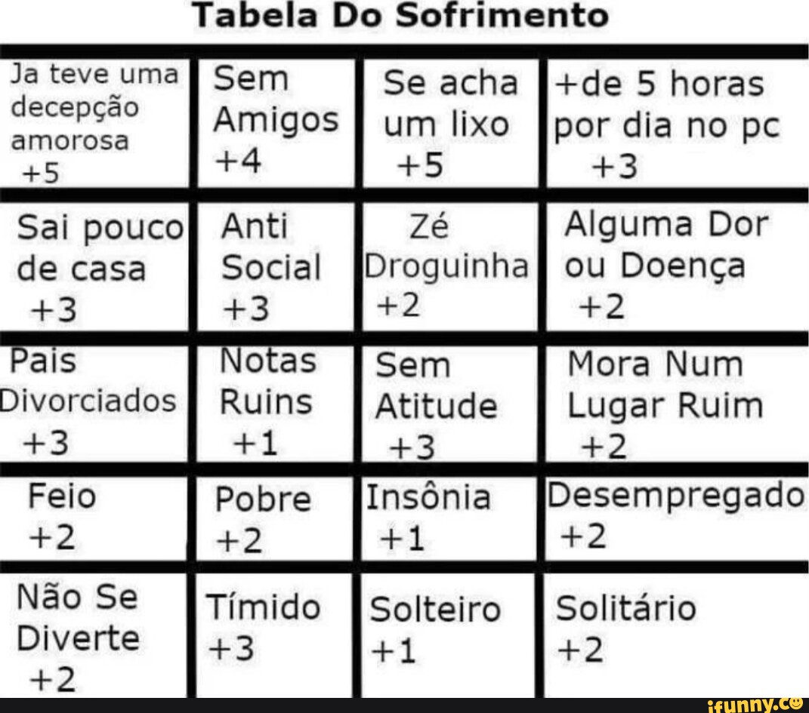

# Tabelas e Gráficos

## Tabelas

As tabelas são estruturas organizadas de dados que permitem a visualização e análise de informações de forma tabular. Elas são amplamente utilizadas na análise de dados, pois permitem a representação clara e concisa de conjuntos de dados.

### Tipos de Variáveis

Ao montar uma tabela, é importante considerar os tipos de variáveis que serão utilizados. Existem três tipos principais de variáveis:

1. **Variáveis Numéricas**: São variáveis que representam valores quantitativos, como idade, altura, peso, entre outros.

2. **Variáveis Categóricas**: São variáveis que representam categorias ou grupos, como gênero, estado civil, cor dos olhos, entre outros.

3. **Variáveis Temporais**: São variáveis que representam datas ou períodos de tempo, como data de nascimento, data de compra, entre outros.

### Montando uma Tabela

Para montar uma tabela, é necessário definir as colunas e as linhas que irão compor a estrutura. Cada coluna representa uma variável e cada linha representa uma observação ou registro.

Aqui está um exemplo de como montar uma tabela simples:

(Brincadeira esqueçam ela)

Aqui está um exemplo de como montar uma tabela simples (boa):

| Nome  | Idade | Gênero |
|-------|-------|--------|
| Maria | 25    | Feminino |
| João  | 30    | Masculino |
| Ana   | 28    | Feminino |

Neste exemplo, temos três colunas (Nome, Idade e Gênero) e três linhas que representam três pessoas diferentes.

### Termos Importantes

Aqui estão alguns termos importantes relacionados a tabelas e análise de dados:

- **Variável**: É uma característica ou atributo que pode ser medido ou observado em uma determinada unidade de análise.

- **Observação**: É uma instância ou registro específico de uma variável.

- **Célula**: É o espaço onde uma variável e uma observação se encontram em uma tabela.

- **Cabeçalho**: É a linha superior da tabela que contém os nomes das colunas.

- **Linha**: É uma sequência de células que representa uma observação.

- **Coluna**: É uma sequência de células que representa uma variável.

- **Dados Faltantes**: São valores ausentes em uma tabela, indicados geralmente por "NA" ou "NaN".

- **Agregação**: É o processo de resumir ou combinar dados em uma tabela para obter informações mais gerais ou úteis.

- **Ordenação**: É o processo de organizar os dados em uma tabela de acordo com uma determinada variável.

- **Filtragem**: É o processo de selecionar apenas as observações que atendem a determinados critérios em uma tabela.

- **Visualização**: É a representação gráfica dos dados em uma tabela, como gráficos, histogramas, entre outros.

## Gráficos

Os gráficos são representações visuais de dados que permitem a análise e interpretação de informações de forma mais intuitiva. Existem diferentes tipos de gráficos, cada um adequado para representar um tipo específico de variável.

**Exemplos de gráficos (Não tenho saco para colocar um exemplo de cada, se quiser vai pesquisar):**

### Gráfico de Barras

O gráfico de barras é utilizado para representar variáveis categóricas. Ele consiste em barras retangulares de comprimentos proporcionais aos valores das categorias. É útil para comparar a frequência ou a quantidade de diferentes categorias.

### Gráfico de Linhas

O gráfico de linhas é utilizado para representar variáveis temporais. Ele mostra a relação entre uma variável ao longo do tempo, sendo ideal para visualizar tendências, padrões e mudanças ao longo de um período.

### Gráfico de Pizza

O gráfico de pizza é utilizado para representar a distribuição de uma variável categórica em relação ao todo. Ele mostra as proporções de cada categoria em relação ao total, sendo útil para destacar a participação de cada categoria.

### Gráfico de Dispersão

O gráfico de dispersão é utilizado para representar a relação entre duas variáveis numéricas. Ele mostra a dispersão dos pontos no plano cartesiano, permitindo identificar correlações ou padrões entre as variáveis.

### Gráfico de Histograma

O gráfico de histograma é utilizado para representar a distribuição de uma variável numérica. Ele agrupa os valores em intervalos e mostra a frequência de ocorrência de cada intervalo, permitindo visualizar a forma da distribuição.

### Gráfico de Setores

O gráfico de setores é utilizado para representar a distribuição de uma variável categórica em relação ao todo, de forma similar ao gráfico de pizza. No entanto, ele é mais adequado quando se deseja destacar a proporção de cada categoria em relação ao total.

### Gráfico de Área

O gráfico de área é utilizado para representar a evolução de uma variável ao longo do tempo, de forma similar ao gráfico de linhas. No entanto, ele preenche a área abaixo da linha, destacando a magnitude da variável em cada ponto.

### Gráfico de Barra Empilhada

O gráfico de barra empilhada é utilizado para representar a distribuição de uma variável categórica em relação a outra variável categórica. Ele empilha as barras de cada categoria, permitindo visualizar a contribuição de cada categoria em relação à outra variável.

### Gráfico de Radar

O gráfico de radar é utilizado para representar múltiplas variáveis numéricas em relação a um ponto central. Ele mostra a relação entre as variáveis em um formato radial, permitindo identificar padrões ou comparações entre as variáveis.

### Gráfico de Caixa

O gráfico de caixa, também conhecido como boxplot, é utilizado para representar a distribuição de uma variável numérica. Ele mostra a mediana, quartis, valores mínimos e máximos, além de identificar possíveis outliers, permitindo visualizar a dispersão e a simetria dos dados.

### Gráfico de Gantt

O gráfico de Gantt é utilizado para representar o cronograma de um projeto. Ele mostra as atividades ao longo do tempo, permitindo visualizar a duração de cada atividade e as dependências entre elas.

### Gráfico de Pareto

O gráfico de Pareto é utilizado para representar a frequência de ocorrência de diferentes categorias em ordem decrescente. Ele destaca as categorias mais relevantes, permitindo identificar os principais problemas ou causas.

### Gráfico de Funil

O gráfico de funil é utilizado para representar a progressão de uma variável categórica em diferentes estágios. Ele mostra a proporção de cada categoria em cada estágio, permitindo visualizar a conversão ou o progresso ao longo do processo.

### Gráfico de Bolhas

O gráfico de bolhas é utilizado para representar três variáveis numéricas em um único gráfico. Ele mostra a relação entre as variáveis através do tamanho e da posição das bolhas, permitindo identificar padrões ou tendências.

### Gráfico de Mapa de Calor

O gráfico de mapa de calor é utilizado para representar a distribuição de uma variável em relação a duas variáveis categóricas. Ele mostra a intensidade da variável através de cores, permitindo visualizar padrões ou tendências em uma matriz de dados.

### Gráfico de Rede

O gráfico de rede, também conhecido como grafo, é utilizado para representar a relação entre diferentes entidades. Ele mostra os nós (entidades) e as arestas (relações), permitindo visualizar a estrutura e as conexões entre os elementos.

### Gráfico de Sankey

O gráfico de Sankey é utilizado para representar o fluxo de uma variável entre diferentes categorias. Ele mostra as proporções de entrada e saída de cada categoria, permitindo visualizar a distribuição e o direcionamento do fluxo.

### Gráfico de Árvore

O gráfico de árvore é utilizado para representar hierarquias ou estruturas de dados em forma de árvore. Ele mostra os nós (elementos) e as ramificações (relações), permitindo visualizar a organização e a relação entre os elementos.

### Gráfico de Waffle

O gráfico de waffle é utilizado para representar a distribuição de uma variável categórica em forma de quadrados. Cada quadrado representa uma proporção da categoria, permitindo visualizar a participação de cada categoria em relação ao todo.

### Gráfico de Função

O gráfico de função é utilizado para representar a relação entre uma variável independente e uma variável dependente. Ele mostra a curva ou o comportamento da função, permitindo visualizar as mudanças na variável dependente em relação à variável independente.

### Gráfico de Polar

O gráfico de polar é utilizado para representar dados em coordenadas polares. Ele mostra a relação entre ângulos e distâncias, permitindo visualizar padrões ou tendências em um formato circular.
